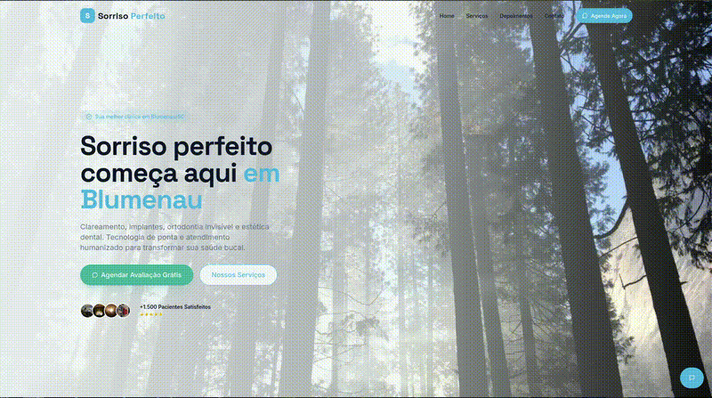

# Sorriso Perfeito Blumenau - Landing Page

Landing page moderna, responsiva e otimizada para conversão de uma clínica odontológica em Blumenau/SC.  
Exemplo de portfólio front-end para freelas rápidos.

**Live Demo:**  
[Sorriso Perfeito](https://landing-page-odonto-blumenausc.vercel.app/)

  

## Sobre o Projeto

Página fictícia para a "Sorriso Perfeito Blumenau", com design clean, cores de confiança (azul claro, branco, verde menta) e foco em atrair pacientes locais via WhatsApp e formulário.

### Seções Principais
- **Hero**: "Sorriso perfeito começa aqui em Blumenau" + subtítulo com serviços + "+1.500 Pacientes Satisfeitos ★★★★★"
- **Serviços (Nossos Tratamentos)**: 6 cards detalhados  
  - Clareamento Dental  
  - Implantes Dentários  
  - Aparelho Invisível  
  - Limpeza e Profilaxia  
  - Estética Dental  
  - Emergência 24h  
- **Resultados Reais (Antes/Depois)**: Exemplos de lentes de contato e ortodontia com transformações
- **Depoimentos**: 3 avaliações reais (Mariana Silva, Ricardo Mendes, Helena Souza) com 4.9/5 no Google
- **Contato**: Endereço (Rua Sete de Setembro, 1234 - Centro, Blumenau/SC), WhatsApp (47) 99999-9999, horários, botão "Ligar Agora" + formulário simples ("Enviar Solicitação")
- Navbar e footer com links essenciais

### Tecnologias Usadas

* HTML5
* CSS3
* TypeScript
* JavaScript Básico (Interações leves)
* Tailwind CSS
* Deploy: **Vercel**

### Features
- 100% responsivo (mobile-first)
- Tema de saúde e confiança (azul/verde menta)
- CTA direto: WhatsApp e telefone
- Código limpo com comentários em PT-BR
- Fácil de customizar para clientes reais (troque textos, fotos, telefone)
